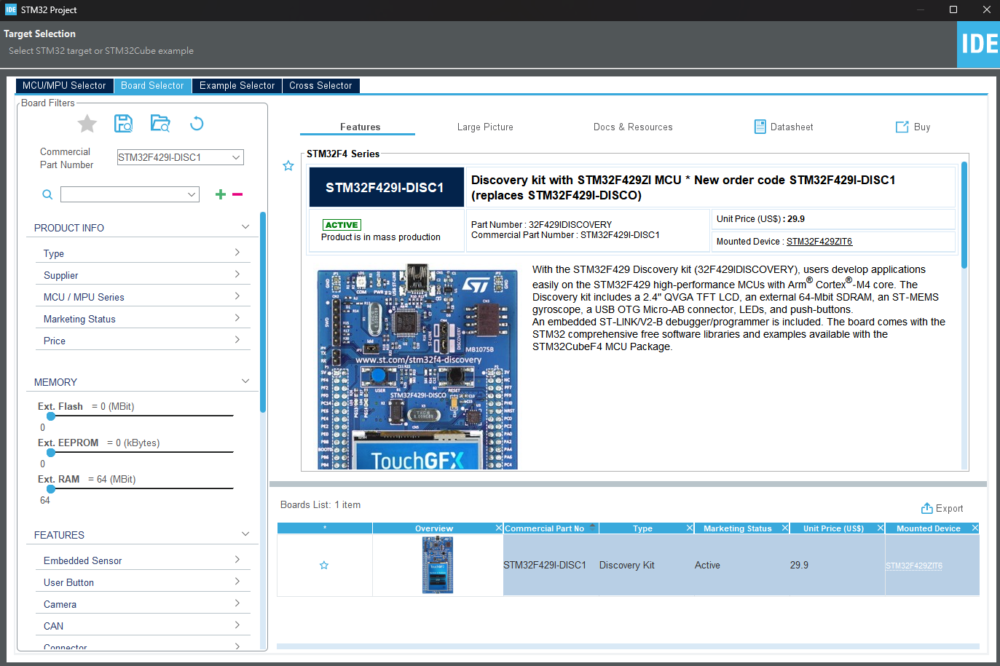

STM32F249I-DISC1 使用 cubeMX 做開發，官方註冊後登入即可下載。之後可去左上角 File -> New -> STM32 Project 新增專案\
\
再到 Board selector 選擇板子輸入板子號就可以去選擇板子，這邊進入可會幫你做外設電路初始化，生成出來的專案也會有 .ioc 檔，可以在這邊對電路做更詳細的設定。\
\
```
{path}\STM32Cube\Repository\STM32Cube_FW_F4_V1.28.3\Projects\STM32F429I-Discovery\Examples
```
此路徑下有官方提供的範例可以直接跑，IDE 則是在 {path}\STM32CubeIDE，路徑不一樣，所以需要把一些外設 DRIVER 複製到專案中。
```
{path}\STM32Cube\Repository\STM32Cube_FW_F4_V1.28.3\Drivers\
```
裡面有螢幕、IO、陀螺儀、RAM、ROM 等外設驅動，可以參考板子文件
